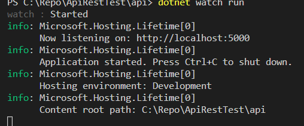
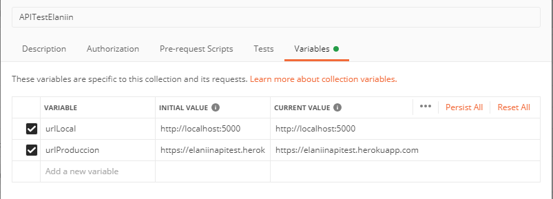

# ApiRest Test para Elaniin

Creación de una Api Rest con .net core 3.2 y SQL Server para la prueba de Elaniin, creada con arquitectura **clean architecture** para garantizar el orden y la mejor distribución dentro del proyecto, así como una respuesta rápida que evite el alentamiento de la consulta al utilizar métodos o tecnologías de una manera no eficiente.

## Iniciando

Para poder inicializar el proyecto se deja una colección en postman para poder ejecutar todos los CRUD junto con sus respectivas validaciones, tanto de manera local como en ambiente de producción mediante la separación en carpetas para cada ambiente, a continuacion se detallan los prerequisitos y la manera para inicializar el proyecto.

### Prerrequisitos

 * Version de .Net Core 3.2.1 
 * Visual Studio Code o Microsoft visual studio 2019
 * SLQ Server 2012 o superior
 * Postman

### Ejecutando 

Clonar el repositorio de Git a su máquina local y abrir la carpeta con visual studio code o inicializar con microsoft visual studio 2019 dando clic en ApiRestTest.sln para que cargue el proyecto.

Posterior abrir el archivo appsettings.Development.json y aquí es necesario modificar dentro de ConnectionStrings/DefaultConnection el Data Source que tengan configurado en SQL Server. A continuación pongo un ejemplo:

```
"Data Source=SQLTEST\\SQL2K8R2;Initial Catalog=ComputerSupplies;Trusted_Connection=True;MultipleActiveResultSets=true"
```

Una vez se haya realizado este cambio y guardado podemos proceder a iniciar el código, no es necesario crear la base de datos o ejecutar los scripts dado que en el proyecto se ha configurado con la creacion de la base de datos y los Seeders necesarios para todas las tablas que se inicializa una vez se ejecute el proyecto de manera local.

Si se **utiliza Visual Studio 2019** únicamente es necesario darle clic a ejecutar para iniciar el proyecto (solo asegurarse que el proyecto api sea el principal al ejecutar el código.

Para ejecutar el proyecto desde **visual studio code** es necesario abrir la terminal desde Terminal new terminal o nueva terminal y ejecutar los siguientes comandos:

```
cd api
```
```
dotnet watch run
```


Al presionar enter saldrá lo siguiente: 



Luego de esto podemos entrar a SQL Server Management Studio refrescar la data y debería de haberse creado la base de datos con sus respectivas tablas y data. 

**Si no se crea la base de datos automáticamente** En caso que no se haya creado la Base de datos realizar el siguiente paso, caso contrario omitir, ejecutar los scripts en SQL Server Management Studio que se encuentran en el proyecto dentro de la carpeta Documents/SQL 

 * DBComputerSupplies.sql

### Cargando la colección dentro de Postman

Para cargar la colección de endpoints en postman es necesario abrir postman y en la parte superior izquierda dar clic a File y a Import, luego en la nueva ventana que se abre dar clic en Choose Files y es necesario ir a la carpeta de nuestro proyecto y entrar a la carpeta de Documentacion/Postman y seleccionar el archivo **APITestElaniin.postman_collection.json**

una vez cargue la colección ir a la tab de Collections y ahí aparecerá nuestra colección con el nombre ApitestElaniin, dentro de esa carpeta hay dos subcarpetas con todos los endpoints necesarios.

La carpeta LocalHost contiene los enpoints apuntando a LocalHost:5000 para poder ejecutarlos localmente 
La carpeta Produccion contiene los enpoints apuntando a una url donde se encuentra el api publicada

Los endpoint posee una descripción de lo que realiza cada uno y adicional en la carpeta Documents/Postman se adjunta un documento Word donde explica cada uno de ellos.

En caso de querer cambiar las variables guardadas en postman para apuntar a una url diferente entrar a editar la colección e ir a la tab de Variables, ahí se encuentran las dos variables utilizadas en esta colección, al cambiarla se cambia en automático todos los endpoint.



## Api realizada con 

* [VisualStudioCode](https://code.visualstudio.com/) - El editor de texto utilizado
* [DotNet 3.1](https://dotnet.microsoft.com/download/dotnet-core) - El framework utilizado

### Tecnologias y paquetes

* JWT - Creacion de tokens
* FluentValidation - Validacion de campos
* MediatR - Desacoplar la gestion de mensages
* AutoMapper - Mappeo de un objeto a otro 
* Cloudinary - Servidor para almacenamiento de imagenes

## Autor

* **Jorge Herrera** 
